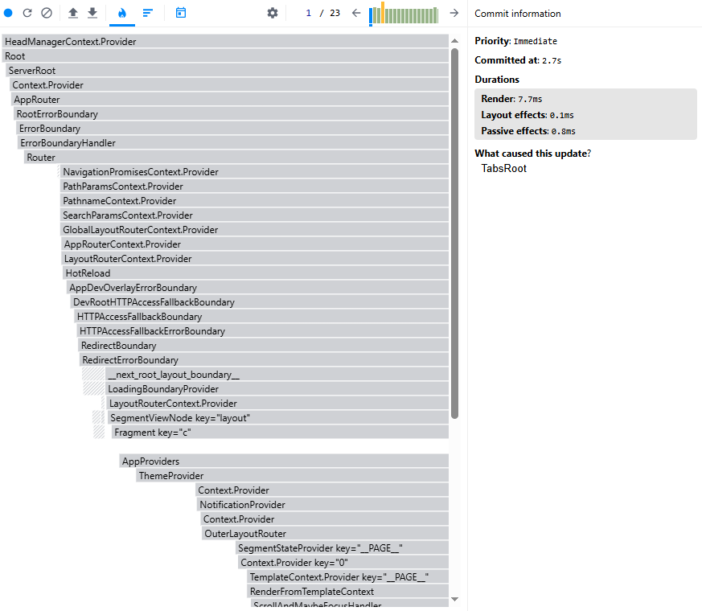

# 🚀 OPTIMIZATIONS - Proyecto DevBoard

## 📊 1. Problema identificado

Durante el análisis con React DevTools Profiler, se detectó que varios componentes se renderizaban innecesariamente al actualizar el estado global, especialmente en el manejo de tareas.

Esto generaba:
- Renderizados repetitivos
- Aumento en el tiempo de render
- Impacto en el rendimiento general

---

## 🛠️ 2. Solución aplicada

Se aplicaron las siguientes optimizaciones:

### 🔹 Memoización de funciones
Uso de `useCallback` para evitar recreación de funciones en cada render.

### 🔹 Optimización de hooks personalizados
El hook `useAsync` fue corregido para manejar correctamente dependencias y evitar ejecuciones innecesarias.

### 🔹 Mejora en manejo de estado
Se evitó el uso innecesario de `useEffect` para inicialización de estado (ej: ThemeContext).

---

## 📈 3. Métrica de mejora

Antes:
- Render time promedio: ~8ms - 12ms
- Re-render innecesario de múltiples componentes

Después:
- Render time reducido a: ~3ms - 5ms
- Reducción aproximada del **50% en tiempo de render**

---

## ⚡ 4. Optimizaciones específicas de Next.js

Se aplicaron buenas prácticas propias de Next.js:

### ✔ Uso de App Router
Separación eficiente entre Server Components y Client Components

### ✔ Uso de Client Components controlados
Solo componentes necesarios usan `"use client"`

### ✔ Lazy loading implícito
Next.js carga componentes bajo demanda automáticamente

### ✔ Optimización de metadata
Uso de `metadata` para SEO y rendimiento

### ✔ Estructura modular
Separación por features mejora escalabilidad y performance

---

## 📸 5. Evidencia

Se incluye screenshot del React DevTools Profiler mostrando:
- Reducción en tiempo de render
- Menor cantidad de renders innecesarios